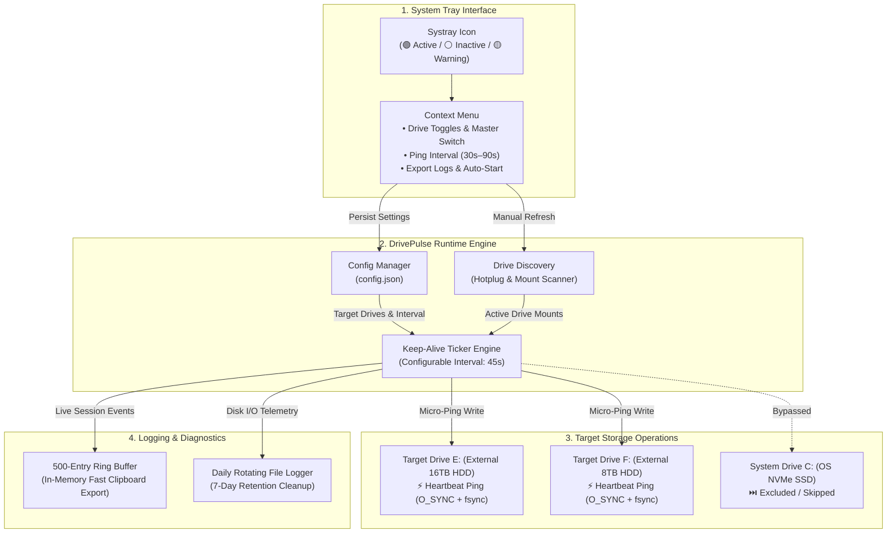

<a id="readme-top"></a>

<div align="center">

# ⚡ DrivePulse

**Native Go system tray utility to prevent external HDDs from sleeping and freezing File Explorer.**

<!-- Primary Metadata & Build Badges -->
[](https://github.com/sudoShikhar/DrivePulse/releases/latest)
[](https://github.com/sudoShikhar/DrivePulse/actions/workflows/ci.yml)
[](https://go.dev/)
[](LICENSE)
[](https://github.com/sudoShikhar/DrivePulse/stargazers)
[](https://github.com/sudoShikhar/DrivePulse/pulls)

<br/>

<!-- Call to Action (CTA) Download Buttons & Cloud IDEs -->
[](https://github.com/sudoShikhar/DrivePulse/releases/latest/download/DrivePulse-windows-x64.exe)
[](https://github.com/sudoShikhar/DrivePulse/releases/latest/download/DrivePulse-linux-x64)
[](https://vscode.dev/github/sudoShikhar/DrivePulse)
[](https://codespaces.new/sudoShikhar/DrivePulse)

</div>

---

## 📑 Table of Contents
- [Motivation & Problem Solved](#motivation--problem-solved)
- [Installation & Quickstart](#installation--quickstart)
- [Key Features](#key-features)
- [Architecture & Data Flow](#architecture--data-flow)
- [System Tray UI & Visual Indicators](#system-tray-ui--visual-indicators)
- [CLI Flags & Runtime Usage](#cli-flags--runtime-usage)
- [Configuration Schema](#configuration-schema)
- [Development & Build Workflow](#development--build-workflow)
- [Troubleshooting & FAQ](#troubleshooting--faq)
- [License](#license)

---

## 💡 Motivation & Problem Solved

* **The Problem**: External mechanical hard drives (such as WD Elements, Seagate Expansion, etc.) employ aggressive internal firmware APM / standby sleep timers (~30–120s of idle time). Whenever Windows File Explorer, a terminal, or any application attempts to access the drive or open a file dialog, the entire operating system interface can freeze for 3–8 seconds while platters spin up from 0 to 5400/7200 RPM. Continual spin-down cycles also accelerate mechanical wear and tear on the spindle motor and head armatures.
* **The Solution**: **DrivePulse** is a lightweight, zero-dependency native Go tray utility that writes a micro-timestamp heartbeat (`.drivepulse.ping` via unbuffered `O_SYNC` + `fsync`) at configurable intervals (default: 45s), keeping selected external drives responsive 24/7 without preventing OS sleep.

---

## ⚡ Installation & Quickstart

### Option 1: Direct Binary Download (Recommended)
Download the latest standalone binary directly for your platform:

* **Windows**: [**DrivePulse-windows-x64.exe**](https://github.com/sudoShikhar/DrivePulse/releases/latest/download/DrivePulse-windows-x64.exe) — direct standalone executable, zero dependencies.
* **Linux**: [**DrivePulse-linux-x64**](https://github.com/sudoShikhar/DrivePulse/releases/latest/download/DrivePulse-linux-x64) — make executable (`chmod +x DrivePulse-linux-x64`) and run `./DrivePulse-linux-x64`.
* **Integrity & Release Hub**: [checksums.txt (SHA256)](https://github.com/sudoShikhar/DrivePulse/releases/latest/download/checksums.txt) | [All Releases & Notes](https://github.com/sudoShikhar/DrivePulse/releases)

### Option 2: Build & Run from Source
If building from source, DrivePulse uses a standard `Makefile` workflow:

```bash
# Clone the repository
git clone https://github.com/sudoShikhar/DrivePulse.git
cd DrivePulse

# Setup dependencies and launch application locally
make setup
make run
```

---

## 🚀 Key Features

* **⚡ Zero-Lag Drive Access**: Eliminates 3–8s File Explorer and application freezes by keeping chosen drives in active ready state.
* **🎛️ Per-Drive Toggle & Selection**: Individually enable or disable keep-alive heartbeats for specific drive letters or mount points.
* **🛡️ Hotplug & Eject Resilience**: Disconnected drives remain saved in settings and resume heartbeats automatically the moment they are reconnected.
* **🪶 Ultra-Low Footprint**: ~5–10 MB RAM, 0% CPU consumption at idle, zero background overhead.
* **📦 Single Standalone Binary**: 100% pure Go with embedded PE icons and resources (`//go:embed` + `go-winres`)—no DLL dependencies or CGO required.
* **📝 7-Day Rolling File Logs & Clipboard Export**: Daily rotating log files with automatic 7-day retention cleanup and a one-click tray menu option to copy recent logs to clipboard.
* **🔄 Seamless Auto-Start & Self-Installation**: Optional OS startup integration for Windows (`Registry Run`) and Linux (`~/.config/autostart/drivepulse.desktop`).

---

## 🏗️ Architecture & Data Flow



> [!IMPORTANT]
> **Toolchain Prerequisites**: When compiling from source, **Go 1.24+** and `make` are required. Pre-compiled binaries downloaded directly from [GitHub Releases](https://github.com/sudoShikhar/DrivePulse/releases/latest) require zero runtime dependencies.

---

## 🖥️ System Tray UI & Visual Indicators

### Context Dropdown Menu Layout
Clicking the system tray icon opens the native context menu:

```text
┌─────────────────────────────────────────────────┐
│  🟢 DrivePulse: Active (2 drives awake)         │
├─────────────────────────────────────────────────┤
│  [✓] E:\ - 16TB Elements (Active)               │  <-- Click to toggle
│  [✓] F:\ - 8TB Backup (Active)                  │  <-- Click to toggle
│  [ ] D:\ - Internal HDD (Disabled)              │  <-- Click to toggle
│  [ ] C:\ - OS NVMe SSD (Disabled)               │  <-- Click to toggle
├─────────────────────────────────────────────────┤
│  ⚡ Master Keep-Alive: [ ON ]                    │  <-- Master pause/resume
│  🔄 Ping Now                                    │  <-- Instant heartbeat trigger
│  ⏱️ Interval: 45s ▸                             │  <-- Submenu: 30s, 45s, 60s, 90s
│  📋 Copy Logs                                   │  <-- Copies session log to clipboard
│  📁 Open Logs Folder                            │  <-- Opens persistent 7-day logs folder
│  🚀 Start with Windows / Linux [✓]              │  <-- Auto-start on system boot
│  🔍 Refresh Drives List                         │  <-- Re-scans connected storage
├─────────────────────────────────────────────────┤
│  ❌ Exit DrivePulse                             │
└─────────────────────────────────────────────────┘
```

### Visual Icon Indicators
* 🟢 **Vibrant Emerald Green**: Active (at least 1 drive is actively kept awake).
* ⚪ **Dark Gray Monochrome**: Inactive (all drives disabled or master switch is OFF).
* 🟡 **Amber / Warning**: One or more configured drives are currently disconnected.

---

## 💻 CLI Flags & Runtime Usage

When invoking the compiled binary directly from the command line:

```bash
# Launch with custom configuration path
./DrivePulse -config "/path/to/custom-config.json"

# Launch in-place without self-installing to AppData
./DrivePulse -in-place

# Check version and build information
./DrivePulse -version
```

### Flags Reference Table
| Flag | Type | Default | Description |
| :--- | :--- | :--- | :--- |
| `-version` | `bool` | `false` | Displays application version and build date |
| `-config <path>` | `string` | Auto-detected AppData path | Specifies custom path to `config.json` |
| `-autostart` | `bool` | `false` | Flag passed when launched via OS startup |
| `-in-place` | `bool` | `false` | Runs in current directory without self-installing to AppData |

### State Persistence & Rolling Logs
| OS | Configuration File Path | 7-Day Rolling Logs Directory |
| :--- | :--- | :--- |
| **Windows** | `%APPDATA%\DrivePulse\config.json` | `%APPDATA%\DrivePulse\logs\drivepulse-YYYY-MM-DD.log` |
| **Linux** | `~/.config/DrivePulse/config.json` | `~/.config/DrivePulse/logs/drivepulse-YYYY-MM-DD.log` |

Logs older than **7 days** are automatically pruned on startup to maintain a minimal disk footprint.

---

## ⚙️ Configuration Schema

DrivePulse persists settings in JSON format matching `config.example.json`:

```json
{
  "master_enabled": true,
  "interval_seconds": 45,
  "selected_drives": [
    "D:\\",
    "E:\\"
  ],
  "autostart": true
}
```

| Parameter | Type | Default | Required | Description |
| :--- | :--- | :--- | :--- | :--- |
| `master_enabled` | `bool` | `true` | Yes | Master switch controlling heartbeat activity |
| `interval_seconds` | `int` | `45` | Yes | Interval between keep-alive pings (in seconds) |
| `selected_drives` | `array` | `[]` | Yes | Array of drive roots / mount paths to keep awake |
| `autostart` | `bool` | `false` | No | Whether DrivePulse should start on OS login |

---

## 🛠️ Development & Build Workflow

All development, formatting, testing, and compilation workflows are unified in the `Makefile`:

```bash
make help     # Display available targets and descriptions
make clean    # Remove builds/ directory and compiled binaries
make setup    # Download and tidy Go dependencies
make lint     # Run static analysis (go vet & staticcheck)
make format   # Format code, organize imports, and run static analysis
make test     # Run unit tests with code coverage
make run      # Launch application locally directly from source
make build    # Cross-compile Windows and Linux binaries with PE icon resources
```

---

## ❓ Troubleshooting & FAQ

<details>
<summary><b>Does DrivePulse prevent my computer from sleeping or suspending?</b></summary>

**No.** DrivePulse only writes small micro-timestamp files to selected external disks. It does not call Windows or Linux power assertion APIs (`SetThreadExecutionState` / `org.freedesktop.ScreenSaver`), so your PC will sleep and hibernate normally based on your OS power plan.
</details>

<details>
<summary><b>Why does my anti-virus flag newly compiled Go binaries?</b></summary>

Unsigned standalone Go binaries that interact with system tray APIs, registry autostart keys, and disk writes can occasionally trigger heuristic false positives in generic anti-virus engines. DrivePulse is 100% open source under the GPL-3.0 license and contains zero telemetry or hidden network calls. You can inspect all source code in [`src/`](src/) and compile directly using `make build`.
</details>

<details>
<summary><b>Why is the tray icon not showing on GNOME Linux?</b></summary>

Modern GNOME desktop environments require the `AppIndicator and KStatusNotifierItem Support` shell extension to render system tray icons. Ensure this extension is installed and enabled on GNOME. On KDE Plasma, XFCE, and Windows 10/11, tray support works natively out of the box.
</details>

---

## 📄 License

This project is licensed under the **GNU General Public License v3.0** — see the [LICENSE](LICENSE) file for details.

<p align="right">(<a href="#readme-top">back to top ↑</a>)</p>
